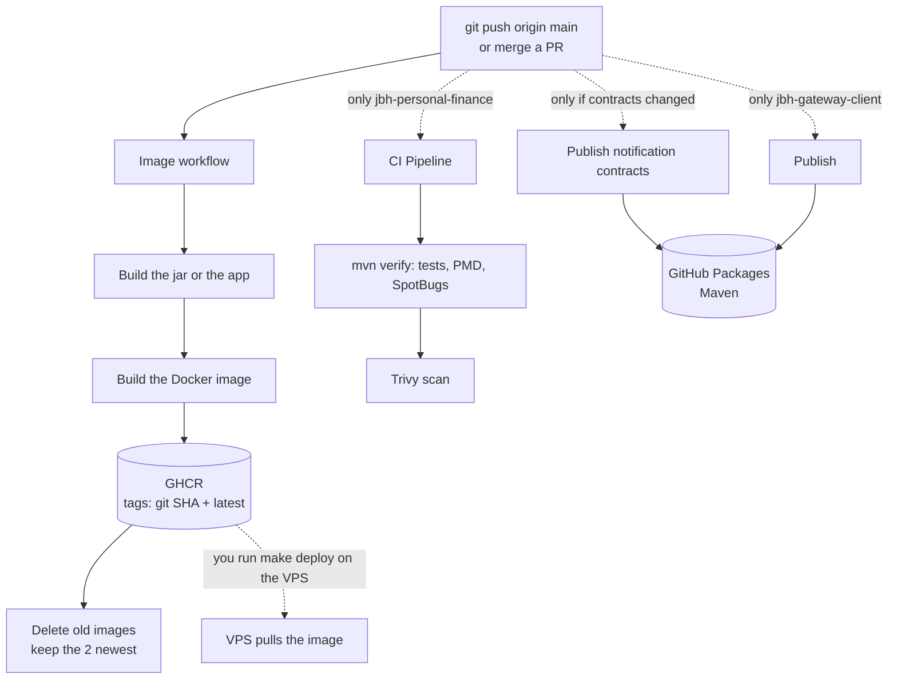

# JBH CI (GitHub Actions)

This file explains what GitHub Actions does in each JBH repo.
It covers what runs on a push to `main`, on a pull request, and by hand.
For the deploy commands on the VPS, read [`DEPLOY.md`](DEPLOY.md).

## The short version

- **CI builds, the VPS only pulls.** CI never deploys. After CI is green, you run `make deploy s=<service>` on the VPS.
- **Merging a PR into `main` is a push to `main`.** The same workflows run.
- **Only `jbh-personal-finance` runs tests.** The other repos only build.
- **Images do not wait for tests.** In `jbh-personal-finance`, `CI Pipeline` and `Image` run side by side.
  A red `CI Pipeline` still publishes an image.

## Workflows per repo

| Repo | Workflow (file) | Push to `main` | Pull request | By hand | Publishes |
|------|-----------------|:---:|:---:|:---:|-----------|
| `jbh-app` | `Image` (`image.yml`) | yes | no | yes | image `ghcr.io/kkpa-jbh/jbh-web` |
| `jbh-gateway` | `Image` (`image.yml`) | yes | no | yes | image `ghcr.io/kkpa-jbh/jbh-gateway` |
| `jbh-iam` | `Image` (`image.yml`) | yes | no | yes | image `ghcr.io/kkpa-jbh/jbh-iam` |
| `jbh-personal-finance` | `Image` (`image.yml`) | yes | no | yes | image `ghcr.io/kkpa-jbh/jbh-personal-finance` |
| `jbh-personal-finance` | `CI Pipeline` (`ci.yml`) | yes (also `develop`) | yes (into `main` or `develop`) | no | nothing (reports and artifacts) |
| `jbh-personal-finance` | `Publish notification contracts` (`publish-contracts.yml`) | only if the contracts or a parent `pom.xml` changed | no | yes | Maven `jbh-notification-contracts` |
| `jbh-gateway-client` | `Publish` (`publish.yml`) | yes | no | yes | Maven `jbh-gateway-client` |
| `jbh-deploy` | none | — | — | — | nothing. The VPS runs `git pull` |
| `jbh-discovery-nexus` | none | — | — | — | nothing. Production uses the official Consul image |

"By hand": GitHub → the repo → Actions → the workflow → **Run workflow**.

## What happens on a push to `main`

### `Image` (4 service repos)

The same 5 steps in every service repo:

1. **Checkout** the code.
2. **Build**, without tests:
   - `jbh-app`: `npm ci`, then `ng build --configuration production` into `www/`.
   - `jbh-gateway`: `./gradlew bootJar`.
   - `jbh-iam`: `./gradlew :jbh-iam-api:bootJar`. Reads `jbh-gateway-client` from GitHub Packages.
   - `jbh-personal-finance`: `mvn -pl jbh-z-assembly -am -DskipTests package`. Reads `jbh-gateway-client` from GitHub Packages.
3. **Log in** to GHCR with `GITHUB_TOKEN`.
4. **Build and push** the Docker image with two tags: the full git SHA and `latest`.
5. **Delete old images.** Keep only the 2 newest versions. See "Image retention" below.

Time: about 2–4 minutes.

### `CI Pipeline` (`jbh-personal-finance` only)

Runs on a push to `main` or `develop`, and on every pull request into them.

1. **Job `test-and-analyze`:**
   - `mvn clean verify` with `-Dpmd.failOnViolation=true` and `-Dspotbugs.failOnError=true`.
     A failing test, a PMD rule, or a SpotBugs bug makes the job red.
   - Test report (`Maven Tests` check), and PMD and SpotBugs reports as artifacts (kept 30 days).
   - On a pull request only: a comment on the PR with an analysis summary.
2. **Job `security-scan`** (only after job 1 is green):
   - Trivy scans the files for known vulnerabilities. It never fails the job (`exit-code: 0`).
   - The JSON report is an artifact (kept 30 days).

### `Publish notification contracts` (`jbh-personal-finance`)

Runs on a push to `main` only when one of these paths changed:
`jbh-notification/jbh-notification-contracts/**`, `jbh-notification/pom.xml`, `pom.xml`.
It runs `mvn deploy` for the contracts and their parent POMs (`-am`), because a consumer cannot resolve the contracts without the parents.

### `Publish` (`jbh-gateway-client`)

Runs on every push to `main`. It runs `mvn deploy` and publishes the library to GitHub Packages.
The version is `1.0.0-SNAPSHOT`, so each run replaces the previous build.

## Pull requests

Only `jbh-personal-finance` checks a pull request (`CI Pipeline`). No other repo runs anything on a PR.
Nothing blocks a merge: `main` has no branch protection in any repo (checked on 2026-09-26), so no check is required.
After the merge, the push to `main` starts the normal workflows above.

The usual way of working is to push straight to `main` (no ticket branches).

## Order for shared libraries

The services include the libraries when CI builds them. So when a library changes, publish in this order:

1. `jbh-personal-finance` → `Publish notification contracts` (only if the contracts changed).
2. `jbh-gateway-client` → `Publish`.
3. `jbh-iam` and `jbh-personal-finance` → `Image` (push, or **Run workflow**).

If you skip a step, the image is built with the old library. `DEPLOY.md` §2.3 has the full steps.

## Image retention

- GitHub Free gives 500 MB for private packages.
- `actions/delete-package-versions` keeps the **2 newest** versions of each image: the one you run and one to roll back to.
- `provenance: false` keeps one version per push. Without it, build attestations add untagged versions that use up the 2 slots.
- Deleted images are gone for good. A rollback reaches only one deploy back.
- Maven packages (contracts, gateway-client) are not cleaned up.

## Secrets

| Secret | Where | What for |
|--------|-------|----------|
| `GITHUB_TOKEN` | automatic, every workflow | Push images to GHCR, delete old images, deploy the repo's own Maven package |
| `PACKAGES_READ_TOKEN` | repo secret in `jbh-gateway-client`, `jbh-iam`, `jbh-personal-finance` | Read another repo's Maven package. A classic PAT with only `read:packages` |

GitHub Packages for Maven is repository-scoped: `GITHUB_TOKEN` reads only its own repo's packages.
That is why `PACKAGES_READ_TOKEN` exists. When it expires, renew it in all three repos.
Maven uses `-s .github/maven-settings.xml -Pgithub`; Gradle (`jbh-iam`) adds the GitHub repositories only when `PACKAGES_READ_TOKEN` is set.

## What CI does not do

- It does not deploy. You run `make deploy s=<service>` on the VPS.
- It does not run tests for `jbh-app`, `jbh-gateway`, `jbh-iam` or `jbh-gateway-client`.
- It does not stop an image when `CI Pipeline` fails.
- It does not run the dev server. Some bugs appear only in the production build (`ng build --configuration production`),
  so test the app that way before a deploy.
