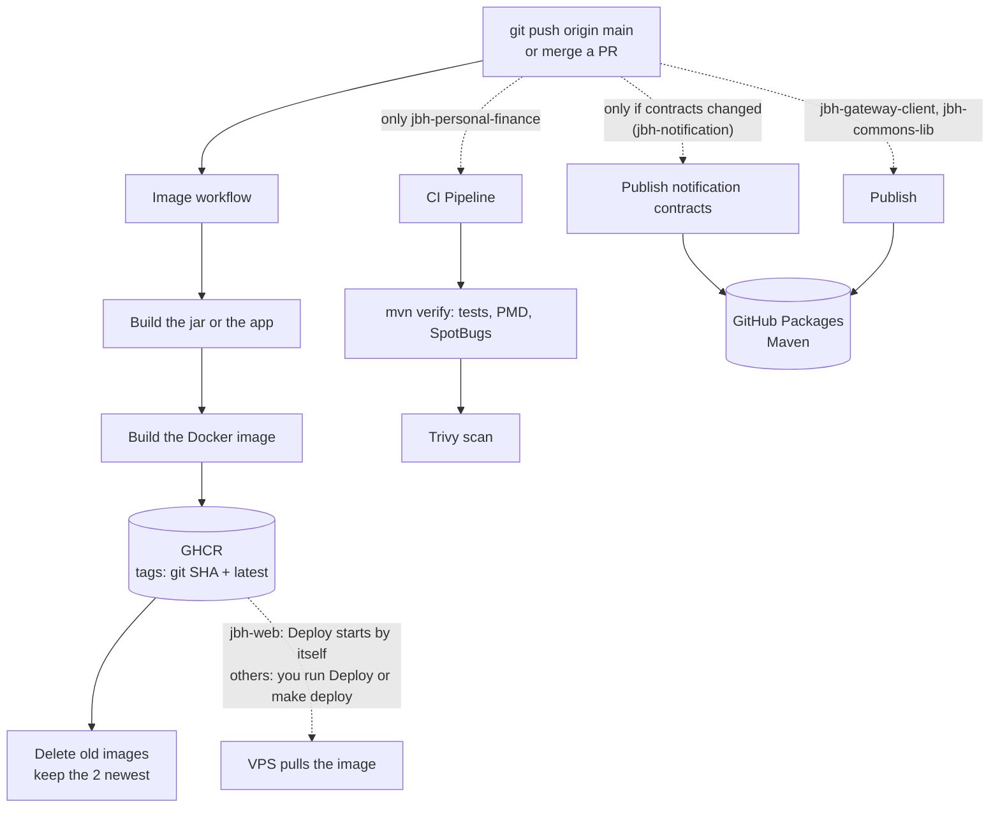

# JBH CI (GitHub Actions)

This file explains what GitHub Actions does in each JBH repo.
It covers what runs on a push to `main`, on a pull request, and by hand.
For the deploy commands on the VPS, read [`DEPLOY.md`](DEPLOY.md).

## The short version

- **CI builds, the VPS only pulls.** Only `jbh-web` deploys by itself: after a merge into `jbh-app`, when the repo
  variable `AUTO_DEPLOY` is `true` ("Auto-deploy" below). For the other services, after `Image` is green, you start
  the deploy by hand: the `Deploy` workflow in `jbh-deploy`, or `make deploy s=<service>` on the VPS.
- **Merging a PR into `main` is a push to `main`.** The same workflows run.
- **Three repos run tests on a pull request:** `jbh-personal-finance`, `jbh-commons-lib` and `jbh-notification` (`mvn verify`).
  The other repos only build.
- **Images do not wait for tests.** In `jbh-personal-finance`, `CI Pipeline` and `Image` run side by side.
  A red `CI Pipeline` still publishes an image.

## Workflows per repo

| Repo | Workflow (file) | Push to `main` | Pull request | By hand | Publishes |
|------|-----------------|:---:|:---:|:---:|-----------|
| `jbh-app` | `Image` (`image.yml`) | yes | no | yes | image `ghcr.io/kkpa-jbh/jbh-web`, then starts `Deploy` for it (only with `AUTO_DEPLOY`) |
| `jbh-gateway` | `Image` (`image.yml`) | yes | no | yes | image `ghcr.io/kkpa-jbh/jbh-gateway` |
| `jbh-iam` | `Image` (`image.yml`) | yes | no | yes | image `ghcr.io/kkpa-jbh/jbh-iam` |
| `jbh-personal-finance` | `Image` (`image.yml`) | yes | no | yes | image `ghcr.io/kkpa-jbh/jbh-personal-finance` |
| `jbh-personal-finance` | `CI Pipeline` (`ci.yml`) | yes (also `develop`) | yes (into `main` or `develop`) | no | nothing (reports and artifacts) |
| `jbh-notification` | `Image` (`image.yml`) | yes | no | yes | image `ghcr.io/kkpa-jbh/jbh-notification` |
| `jbh-notification` | `CI` (`ci.yml`) | no | yes (into `main`) | yes | nothing (job `verify`) |
| `jbh-notification` | `Publish notification contracts` (`publish.yml`) | only if `jbh-notification-contracts/**` or `pom.xml` changed | no | yes | Maven `jbh-notification-contracts` and its parent POM |
| `jbh-commons-lib` | `CI` (`ci.yml`) | no | yes (into `main`) | yes | nothing (job `verify`) |
| `jbh-commons-lib` | `Publish` (`publish.yml`) | yes | no | yes | Maven `jbh-commons-lib` |
| `jbh-gateway-client` | `Publish` (`publish.yml`) | yes | no | yes | Maven `jbh-gateway-client` |
| `jbh-deploy` | `Deploy` (`deploy.yml`) | no | no | yes, or from `jbh-app`'s `Image` | nothing. Deploys one service to the VPS. For this repo's own files, the VPS runs `git pull` |
| `jbh-deploy` | `Multi-arch image` (`multi-arch-image.yml`) | no | no | no | nothing by itself. A reusable workflow (`on: workflow_call`): the `Image` workflow of each service repo calls it to build the amd64 + arm64 images, publish one tag and delete old images |

"By hand": GitHub → the repo → Actions → the workflow → **Run workflow**.

## What happens on a push to `main`

```mermaid
flowchart TD
    push[git push origin main<br/>or merge a PR] --> img[Image workflow]
    push -. only jbh-personal-finance .-> ci[CI Pipeline]
    push -. only if contracts changed<br/>(jbh-notification) .-> pc[Publish notification contracts]
    push -. jbh-gateway-client, jbh-commons-lib .-> pub[Publish]

    img --> build[Build the jar or the app]
    build --> docker[Build the Docker image]
    docker --> ghcr[(GHCR<br/>tags: git SHA + latest)]
    ghcr --> clean[Delete old images<br/>keep the 2 newest]

    ci --> tests[mvn verify: tests, PMD, SpotBugs]
    tests --> trivy[Trivy scan]

    pc --> pkg[(GitHub Packages<br/>Maven)]
    pub --> pkg

    ghcr -. jbh-web: Deploy starts by itself<br/>others: you run Deploy or make deploy .-> vps[VPS pulls the image]
```

### `Image` (5 service repos)

The same steps in every service repo:

1. **Checkout** the code.
2. **Build**, without tests:
   - `jbh-app`: `npm ci`, then `npm run lint:boundary`, then `ng build --configuration production` into `www/`.
     `lint:boundary` fails when a page uses Ionic or ngx-charts directly instead of the `jbh-*` layer. Then no image is built.
   - `jbh-gateway`: `./gradlew bootJar`.
   - `jbh-iam`: `./gradlew :jbh-iam-api:bootJar`. Reads `jbh-gateway-client` from GitHub Packages.
   - `jbh-personal-finance`: `mvn -pl jbh-z-assembly -am -DskipTests package`. Reads `jbh-gateway-client` from GitHub Packages.
   - `jbh-notification`: `mvn -B -U -s .github/maven-settings.xml -Pgithub -pl jbh-notification-app -am -DskipTests package`.
     Reads `jbh-commons-lib` from GitHub Packages.
3. **Log in** to GHCR with `GITHUB_TOKEN`.
4. **Build and push** the Docker image with two tags: the full git SHA and `latest`.
5. **Delete old images.** Keep only the 2 newest versions. See "Image retention" below.
6. **Only `jbh-app`: start `Deploy`** for this commit's image, when `AUTO_DEPLOY` is `true`. See "Auto-deploy" below.

Time: about 2–4 minutes. `jbh-app` runs one `Image` at a time, in push order.

### `Multi-arch image` (`jbh-deploy`, reusable)

A reusable workflow (`on: workflow_call`). It never runs by itself: a service's `Image` workflow calls it with
`uses: kkpa-jbh/jbh-deploy/.github/workflows/multi-arch-image.yml@<jbh-deploy commit SHA>`, after its own job
`package` uploaded the built app as the artifact `app-package`. Inputs: `image`, `package-name`, `context`, `app-package-path`.

1. **`Build image (amd64)`** and **`Build image (arm64)`**: one job per CPU type, each on a native runner
   (`ubuntu-latest`, `ubuntu-24.04-arm`). Each pushes its image by digest only, with no tag.
2. **`Publish multi-arch tag (amd64 + arm64)`**: one tag (`<git-sha>` and `latest`) for both images, only when both exist.
   It fails if the tag does not list `linux/amd64` and `linux/arm64`.
3. **`Delete old images (keep 10 tagged)`**: `dataaxiom/ghcr-cleanup-action`. It counts tagged images, not package versions,
   and keeps each kept image's per-CPU parts.

Why: the VPS is amd64, a Mac (k3d) is arm64, AWS can be both. Each machine pulls its own type from the same tag.
A change here reaches the services only when each caller bumps the pinned SHA.

### `CI Pipeline` (`jbh-personal-finance` only)

Runs on a push to `main` or `develop`, and on every pull request into them.

1. **Job `test-and-analyze`:**
   - `mvn clean verify` with `-Dpmd.failOnViolation=true` and `-Dspotbugs.failOnError=true`.
     A failing test, a PMD rule, or a SpotBugs bug makes the job red.
   - Test report (`Maven Tests` check), and PMD and SpotBugs reports as artifacts (kept 30 days).
   - On a pull request only: a comment on the PR with an analysis summary.
2. **Job `security-scan`** (only after job 1 is green):
   - Trivy scans the files for known vulnerabilities. It never fails the job (`exit-code: 0`).
   - The JSON report is an artifact (kept 30 days).

### `CI` (`jbh-notification`)

Runs on a pull request into `main`, and by hand. One job, `verify`:
`mvn -B -U -s .github/maven-settings.xml -Pgithub -Djbh.test.excludedGroups=none clean verify`.
It runs every test (also the `database` tests, which start PostgreSQL in Docker) and PMD. It reads `jbh-commons-lib` from GitHub Packages.
It publishes nothing. `verify` is a required check in `protect-main` (see "Pull requests").

### `Publish notification contracts` (`jbh-notification`)

Runs on a push to `main` only when `jbh-notification-contracts/**` or `pom.xml` changed, and by hand.
It runs `mvn deploy` for `jbh-notification-contracts` and its parent POM (`-pl jbh-notification-contracts -am`),
because a consumer cannot resolve the contracts without the parent.

### `CI` (`jbh-commons-lib`)

Runs on a pull request into `main`, and by hand. One job, `verify`: `mvn -B verify` (compile, tests, PMD, SpotBugs).
It publishes nothing and needs no token. A new push to the same PR cancels the older run.
`verify` is a required check in `protect-main` (see "Pull requests").

### `Publish` (`jbh-commons-lib`)

Runs on every push to `main`, and by hand. It runs `mvn -B -s .github/maven-settings.xml -DskipTests deploy`
and publishes Maven `jbh-commons-lib` to GitHub Packages. It needs only `GITHUB_TOKEN`.

### `Publish` (`jbh-gateway-client`)

Runs on every push to `main`. It runs `mvn deploy` and publishes the library to GitHub Packages.
The version is `1.0.0-SNAPSHOT`, so each run replaces the previous build.

### `Deploy` (`jbh-deploy`)

By hand: `jbh-deploy` → Actions → `Deploy` → **Run workflow**, then pick the action and the service.
`jbh-app`'s `Image` also starts it for `jbh-web` ("Auto-deploy" below).

- `deploy`: the newest image of that service. Start it only after that repo's `Image` run is green.
  Optional `tag`: a full 40-character git SHA. Then it deploys the image of that commit, not the tag in `.env`.
  `.env` does not change, so a later `deploy` without a tag goes back to the `.env` tag (`latest`).
- `rollback`: the image that ran before the last deploy (`DEPLOY.md` §3). It takes no tag.

1. GitHub connects to the VPS with SSH, as `magus`, with the deploy key.
2. The key can run only `ci-deploy.sh` (a forced command in `~/.ssh/authorized_keys`), whatever the workflow sends.
3. `ci-deploy.sh` accepts only `deploy` or `rollback`, only `jbh-web`, `jbh-gateway`, `jbh-iam`,
   `jbh-personal-finance` and `jbh-notification`, and for `deploy` an optional full git SHA. It changes the image, then waits up to
   3 minutes until the service is healthy. `jbh-web`'s health check loads the page and its main JavaScript file.
4. Green = the service is healthy. Red = it is not: the log shows its last 50 log lines.
   After a red `deploy`, the VPS starts the image from before by itself, and the log says so.

`make deploy` and `make rollback` on the VPS run the same script.
One run per service at a time: a second run for the same service waits. GitHub keeps only one waiting run per
service; a newer one replaces it. Two different services can deploy at the same time.
The VPS runs its own copy of `ci-deploy.sh`, so a change to that file counts only after `git pull` on the VPS.
Setup: `DEPLOY.md` §1.1.

### Auto-deploy (`jbh-app` → `jbh-web`)

After a merge into `jbh-app`'s `main`, `jbh-web` goes live by itself:

1. `Image` builds and pushes `ghcr.io/kkpa-jbh/jbh-web:<sha>`.
2. Its last job, `deploy`, starts `Deploy` in `jbh-deploy` with `deploy`, `jbh-web` and `tag=<sha>`.
   It uses the secret `DEPLOY_DISPATCH_TOKEN`, because `GITHUB_TOKEN` cannot reach another repo.
3. `Deploy` runs as usual: exactly that image, health check, automatic rollback if it is not healthy.

The `deploy` job does not wait for `Deploy`. Check the result in `jbh-deploy` → Actions → `Deploy`.
GitHub emails you when a run you started fails, and the token is yours, so you get those emails.

- **On and off:** repo variable `AUTO_DEPLOY` in `jbh-app` (Settings → Secrets and variables → Actions → Variables).
  `true` = on. Anything else, or no variable = off. No code change needed.
- **The token** is a fine-grained personal access token: only the repo `jbh-deploy`, only "Actions: Read and write".
  It can only manage workflow runs in `jbh-deploy` (start, cancel, delete). It cannot change code or read secrets.
  If it leaks, the worst case is a deploy or rollback of an image that is already in GHCR.
- **The exact commit, not `latest`:** two quick merges cannot mix up versions. `Image` runs one at a time,
  and `Deploy` keeps only the newest waiting run per service.
- **Why only `jbh-web`:** it has no database, so a rollback undoes everything. `jbh-iam` and
  `jbh-personal-finance` run migrations that a rollback does not undo. And in the 4 back-end repos, tests do not
  block the image yet.

Setup: `DEPLOY.md` §1.2.

## Pull requests

Three repos check a pull request: `jbh-personal-finance` (`CI Pipeline`), `jbh-notification` (`CI`) and
`jbh-commons-lib` (`CI`). No other repo runs anything on a PR.
All JBH repos have the ruleset `protect-main` (repo → Settings → Rules → Rulesets):

- No direct push: every change goes through a pull request. 0 approvals, because nobody can approve their own PR.
- No force push, and the branch cannot be deleted.
- Nobody can bypass it, also not an org admin. To change it, edit the ruleset.
- No check is required in the other repos, so a red `CI Pipeline` does not block a merge there.
  In `jbh-notification` and `jbh-commons-lib`, `verify` is a required status check (since 2026-11-14),
  so a red PR cannot merge.

After the merge, the push to `main` starts the normal workflows above.

## Order for shared libraries

The services include the libraries when CI builds them. So when a library changes, publish in this order:

1. `jbh-commons-lib` → `Publish`.
2. `jbh-notification` → `Publish notification contracts` (only if the contracts changed).
3. `jbh-gateway-client` → `Publish`.
4. `jbh-iam`, `jbh-personal-finance` and `jbh-notification` → `Image` (push, or **Run workflow**).

If you skip a step, the image is built with the old library. `DEPLOY.md` §2.3 has the full steps.

## Image retention

- GitHub Free gives 500 MB for private packages. Public packages do not count.
- `actions/delete-package-versions` keeps the **2 newest** versions of each image: the one you run and one to roll back to.
- `provenance: false` keeps one version per push. Without it, build attestations add untagged versions that use up the 2 slots.
- Deleted images are gone for good. A rollback by commit SHA reaches only one deploy back.
  The `rollback` action does not need GHCR: it uses an image kept on the VPS.
- Maven packages (commons-lib, contracts, gateway-client) are not cleaned up.

## Secrets

| Secret | Where | What for |
|--------|-------|----------|
| `GITHUB_TOKEN` | automatic, every workflow | Push images to GHCR, delete old images, deploy the repo's own Maven package |
| `PACKAGES_READ_TOKEN` | repo secret in `jbh-gateway-client`, `jbh-iam`, `jbh-personal-finance`, `jbh-notification` | Read another repo's Maven package. A classic PAT with only `read:packages` |
| `VPS_HOST` | repo secret in `jbh-deploy` | The VPS IP, for `Deploy` |
| `VPS_SSH_KEY` | repo secret in `jbh-deploy` | Private deploy key. It can run only `ci-deploy.sh` on the VPS |
| `VPS_KNOWN_HOSTS` | repo secret in `jbh-deploy` | The VPS host key, so `Deploy` connects only to the real VPS |
| `DEPLOY_DISPATCH_TOKEN` | repo secret in `jbh-app` | Start `Deploy` in `jbh-deploy` (auto-deploy). A fine-grained PAT: only `jbh-deploy`, only "Actions: Read and write" |

Variable (not secret): `AUTO_DEPLOY` in `jbh-app`. `true` turns auto-deploy on.

GitHub Packages for Maven is repository-scoped: `GITHUB_TOKEN` reads only its own repo's packages.
That is why `PACKAGES_READ_TOKEN` exists. When it expires, renew it in all four repos.
Maven uses `-s .github/maven-settings.xml -Pgithub`; Gradle (`jbh-iam`) adds the GitHub repositories only when `PACKAGES_READ_TOKEN` is set.

## What CI does not do

- It does not deploy on a push, except `jbh-web` with `AUTO_DEPLOY`. You start `Deploy` by hand for the others
  (or run `make deploy` on the VPS).
- It does not roll back a deploy that is healthy but has a bug. Use `rollback` for that (`DEPLOY.md` §3).
- It does not run tests for `jbh-app`, `jbh-gateway`, `jbh-iam` or `jbh-gateway-client`.
  `jbh-notification` runs its tests only on a pull request (`CI`), not on a push to `main`.
- It does not stop an image when `CI Pipeline` fails (or when a test fails in `jbh-notification`: its `Image` skips tests).
- It does not run the dev server. Some bugs appear only in the production build (`ng build --configuration production`),
  so test the app that way before a deploy.
