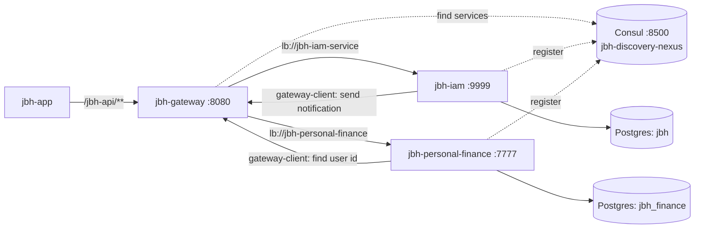

# JBH System

JBH is one system split into several projects.
Each project is its own git repository (GitHub org `kkpa-jbh`), checked out side by side in one folder (`kkpa-jbh/`).
This file explains how the projects connect. It lives in `jbh-deploy`, so it is versioned.
For details on one project, read the `README.md` inside its folder.

## Projects

| Folder | Role | Tech | Port |
|--------|------|------|------|
| `jbh-app` | Frontend (web + mobile) | Ionic / Angular | 8100 (`ionic serve`) |
| `jbh-gateway` | Single entry point for all API calls | Kotlin, Spring Cloud Gateway | 8080 (env `JBH_GATEWAY_SERVER_PORT`) |
| `jbh-iam` | Login, users, user groups, JWT | Kotlin, Spring Boot (Gradle) | 9999 |
| `jbh-personal-finance` | Finance, products, preferences, notifications | Java, Quarkus modular monolith (Maven) | 7777 |
| `jbh-discovery-nexus` | Service discovery (Consul in Docker) | Consul 1.16 | 8500 |
| `jbh-gateway-client` | Java library to call other services through the gateway | Java 21 library (Maven) | - |
| `jbh-deploy` | Production deploy (compose, Caddy site, env) and this system map | Docker Compose | - |
| `logs` | Local log files (not a project) | - | - |

## How they connect



### 1. Frontend to gateway

- `jbh-app` calls every API with the prefix `/jbh-api`.
- In local dev, `proxy.conf.json` sends `/jbh-api` to `http://localhost:8080` (the gateway).
- The app never calls `jbh-iam` or `jbh-personal-finance` directly.

### 2. Gateway to services

The gateway finds services in Consul by name (`lb://<name>`).
Routes live in `jbh-gateway/src/main/resources/application.yml`.

| Path | Target service (Consul name) |
|------|------------------------------|
| `/jbh-api/auth/**` | `jbh-iam-service` (public, no token) |
| `/jbh-api/users/**`, `/jbh-api/user-groups/**` | `jbh-iam-service` |
| `/jbh-api/finance/**`, `/jbh-api/preferences/**` | `jbh-personal-finance` |
| `/jbh-api/notifications/**` | `jbh-personal-finance` |
| `/jbh-api/products/**` | `jbh-personal-finance`, but no endpoint uses it. Products live under `/jbh-api/finance/products`. |
| `/jbh-api/admin/**` | no route. IAM admin endpoints work only on port 9999. |

Real endpoint prefixes in the services:

| Service | Prefix | Defined in |
|---------|--------|-----------|
| `jbh-iam` | `/jbh-api/auth`, `/jbh-api/users`, `/jbh-api/user-groups`, `/jbh-api/admin` | `Routes` + `ApiWebConfig` |
| `jbh-personal-finance` (finance) | `/jbh-api/finance/...` | `ApiConstants`, `FinanceApiRoutes` |
| `jbh-personal-finance` (preferences) | `/jbh-api/preferences/v1`, `/jbh-api/preferences/team-preferences/v1` | `PreferencesApiConstants`, `PreferencesApiRoutes` |
| `jbh-personal-finance` (notifications) | `/jbh-api/notifications/v1` | `NotificationRoutes` |

The gateway also:

- validates the JWT on every path except `/jbh-api/auth/**` (all other paths are protected by default),
- reads the token from the `Authorization: Bearer` header, or from the `JBH_TOKEN` / `__Secure-JBH_TOKEN` cookie,
- applies a rate limit of 10 requests per second per IP.

### 3. Service discovery

- `jbh-discovery-nexus` runs Consul in Docker. UI: http://localhost:8500
- `jbh-gateway`, `jbh-iam` and `jbh-personal-finance` register in Consul at start.
- Consul host: env `CONSUL_HOST` in all three (default `localhost`).
- The address the gateway uses to reach a service is the one it registered:
  `jbh-iam` and `jbh-gateway` register env `CONSUL_DISCOVERY_HOSTNAME` (default `localhost`; Docker: the service name),
  `jbh-personal-finance` registers its container IP (`CONSUL_PREFER_IP=true`).
- If a service is not registered, the gateway cannot route to it.

### 4. Service to service calls

Services do not call each other directly.
They call the **gateway** with the `jbh-gateway-client` library.
The gateway URL comes from `jbh.gateway.base-url` (env `JBH_GATEWAY_URL`, default `http://localhost:8080`).

**If you change the gateway port** (`JBH_GATEWAY_SERVER_PORT`), set `JBH_GATEWAY_URL` to the same port in **both** `jbh-iam` and `jbh-personal-finance`.
If you forget, they keep calling port 8080. On a server where another program uses 8080, finance requests and invitation emails fail.

| Caller | Call | Why |
|--------|------|-----|
| `jbh-personal-finance` (finance, preferences) | `getUserClient().findUserId(...)` → `GET /jbh-api/users/find-user-id` on `jbh-iam` | Get the user id from the JWT |
| `jbh-iam` (user groups) | `getNotificationClient().sendNotification(...)` → `POST /jbh-api/notifications/v1?type=EMAIL` on `jbh-personal-finance` | Send team invitation emails |

### 5. Authentication

- `jbh-iam` issues the JWT (`/jbh-api/auth/signin`). Access token: 15 minutes. Refresh token: 30 days (`/jbh-api/auth/refresh`).
- Tokens travel in the `Authorization` header or in cookies (`JBH_TOKEN` / `__Secure-JBH_TOKEN`).
- `jbh-iam` and `jbh-gateway` share the same HMAC secret: env `JWT_SECRET`.
- `jbh-gateway` validates the token on every path except `/jbh-api/auth/**`.
- `jbh-personal-finance` does not read the JWT itself. It asks `jbh-iam` for the user id through the gateway.

### 6. Databases

Both services use Postgres on `localhost:5432`.

| Service | Database | Env vars |
|---------|----------|----------|
| `jbh-iam` | `jbh` (default, and what `make db-create` creates) | `DB_HOST`, `DB_NAME`, `DB_USERNAME`, `JBH_ADMIN_PASS` |
| `jbh-personal-finance` | `jbh_finance` | `DATABASE_URL`, `DATABASE_USERNAME`, `DATABASE_PASSWORD` |

## Build dependencies between projects

The Java projects share code through the local Maven repository (`~/.m2`).
The order matters:

```
jbh-personal-finance / jbh-notification-contracts
        ↓  (used by)
jbh-gateway-client
        ↓  (used by)
jbh-iam            jbh-personal-finance (finance-infra, preferences-infra)
```

1. Install `jbh-notification-contracts` from `jbh-personal-finance`.
2. Install `jbh-gateway-client`.
3. Build `jbh-iam` and `jbh-personal-finance`.

If you change a public class in `jbh-gateway-client` or in `jbh-notification-contracts`,
reinstall it before you build the services that use it.

**In CI** the same order runs through GitHub Packages (Maven), not `~/.m2`:

1. `jbh-personal-finance` → workflow `publish-contracts` (runs when the contracts change, or by hand).
2. `jbh-gateway-client` → workflow `publish`.
3. Each service repo → workflow `image`: builds the jar and pushes `ghcr.io/kkpa-jbh/<name>:<git-sha>`
   (`jbh-iam`, `jbh-personal-finance`, `jbh-gateway`, `jbh-web` from `jbh-app`).

Maven uses the profile `-Pgithub` in CI; Gradle (`jbh-iam`) adds the GitHub repositories only when `GITHUB_TOKEN` is set.
Each consuming repo needs read access to the package (GitHub → Package settings → Manage Actions access).

## Start order (local)

1. Postgres on `localhost:5432`.
2. `jbh-discovery-nexus` → `docker compose up` (Consul).
3. `jbh-iam` → port 9999.
4. `jbh-personal-finance` (`jbh-z-assembly`) → port 7777.
5. `jbh-gateway` → port 8080.
6. `jbh-app` → `ionic serve`.

Check http://localhost:8500 : `jbh-iam-service`, `jbh-personal-finance` and the gateway (registered as `API Gateway`) must show as healthy.

## Production (Hostinger VPS)

Status: code ready (JBH-40). The first deploy on the VPS is still to do.
Everything lives in the `jbh-deploy` repo: `compose.yaml`, `jbh.caddy`, `.env.example`, `Makefile`,
`initdb/`, `backup-db.sh`.

One subdomain holds the app and the API. The user never sees a port.

```
https://jbh.usemagus.cloud/            → jbh-web (static files from `ng build --configuration production`, served by Caddy)
https://jbh.usemagus.cloud/jbh-api/... → jbh-gateway → jbh-iam / jbh-personal-finance
```

```
Internet ─:443─► Magus Caddy (Docker, owns ports 80/443, imports /etc/caddy/sites/*.caddy)
                   │  shared external Docker network "edge" (subnet 10.231.0.0/24)
                   ├─ /jbh-api/*  → jbh-gateway:8080
                   └─ /*          → jbh-web:8080
                                     │
                 network jbh-private (not on edge)
                   jbh-gateway ─► jbh-iam, jbh-personal-finance, jbh-consul, jbh-postgres
```

Rules:

- **No Nginx and no host ports.** No jbh service has `ports:`. Docker-published ports bypass `ufw`.
  Reach Consul or Postgres with an SSH tunnel to the container IP (`make consul-tunnel`).
- **Only `jbh-gateway` and `jbh-web` join `edge`.** IAM, finance, Consul and Postgres stay on `jbh-private`.
- **Service names are the Docker DNS names and the Consul hostnames:** `jbh-postgres`, `jbh-consul`,
  `jbh-iam`, `jbh-personal-finance`, `jbh-gateway`, `jbh-web`. The `jbh-` prefix avoids clashes on `edge`.
- **`handle /jbh-api/*`, not `handle_path`** in `jbh.caddy`. `handle_path` removes the prefix, and the gateway routes need `/jbh-api`.
- **Caddy changes: `make caddy-install`** (validate, then reload). Never restart Caddy: a bad file would stop Magus too.
- **Rate limit:** Caddy replaces the client's `X-Forwarded-For` with the real client IP. The gateway trusts
  that header only from `JBH_TRUSTED_PROXIES` (the `edge` subnet), so each client gets its own limit.
- **HTTPS:** Caddy gets the certificate for `jbh.usemagus.cloud` by itself, once the DNS `A` record points to the VPS.
- **Same origin:** no CORS config is needed, and the auth cookies are first-party.
  `jbh-app/src/environments/environment.prod.ts` uses the relative `baseUrl: '/jbh-api'`.
- **Images come from CI** (GHCR, tagged with the git SHA). The VPS only pulls (`docker login ghcr.io` with a
  `read:packages` token). No Gradle/Maven build on the VPS: it would fight Magus for 2 vCPU.
- **Rollback:** set the old SHA in `.env` (`JBH_<SERVICE>_TAG`), then `make deploy s=<service>`.
- **Secrets** only in `.env` on the VPS. `JWT_SECRET` is set once and compose passes it to IAM and the gateway.
- **Memory:** every service has a limit, and each JVM has `-Xmx` (defaults: about 2.9 GB total).
- **Postgres:** own container, no host port (Magus already uses `127.0.0.1:5432`), volume `jbh-pgdata`.
  `initdb/` creates `jbh_finance`, its schemas (`finance`, `preferences`, `notifications`) and `pgcrypto` on the first start.
  Migrations run when each service starts (Liquibase). `backup-db.sh` dumps both DBs daily; copy `backups/` off the VPS.

Env vars set by `compose.yaml` inside Docker:

| Service | Env vars |
|---------|---------|
| `jbh-gateway` | `JWT_SECRET`, `CONSUL_HOST=jbh-consul`, `CONSUL_DISCOVERY_HOSTNAME=jbh-gateway`, `JBH_TRUSTED_PROXIES` |
| `jbh-iam` | `SPRING_PROFILES_ACTIVE=prod`, `DB_HOST=jbh-postgres`, `DB_NAME=jbh`, `DB_USERNAME`, `JBH_ADMIN_PASS`, `CONSUL_HOST=jbh-consul`, `CONSUL_DISCOVERY_HOSTNAME=jbh-iam`, `JWT_SECRET`, `GOOGLE_CLIENT_IDS`, `JBH_GATEWAY_URL=http://jbh-gateway:8080` |
| `jbh-personal-finance` | `DATABASE_URL` (no query string), `DATABASE_USERNAME`, `DATABASE_PASSWORD`, `CONSUL_HOST=jbh-consul`, `CONSUL_PREFER_IP=true`, `JBH_GATEWAY_URL=http://jbh-gateway:8080`, `JBH_FRONTEND_URL`, `GMAIL_*` |

**Magus side** (`magus-tesla-api/deploy/docker/`, one-time change):

- `Caddyfile`: top-level `import /etc/caddy/sites/*.caddy` (a glob: an empty folder should only warn —
  **verify on the VPS** with `caddy validate` and an empty folder before relying on it).
- `compose.yaml`, service `caddy`: mount `${CADDY_SITES_DIR:-/home/magus/caddy-sites}` read-only at
  `/etc/caddy/sites`, and join `networks: [default, edge]`. `default` must stay, or Caddy cannot reach `web:8080`.
- `edge` is external: create it (`make network` in `jbh-deploy`) **before** Magus's next `docker compose up`.
- A down jbh container does not affect Magus: Caddy answers `502` only for `jbh.usemagus.cloud`.
- VPS: 7.7 GB RAM, 2 vCPU. Magus reserves about 2 GB.

First deploy (order): DNS `A` record `jbh` → VPS IP · `make network` · Magus `up -d caddy` · `cp .env.example .env`
and fill it · `docker login ghcr.io` · `make up` · `make caddy-install`.

## Add a new API route (checklist)

1. Add the endpoint in the service (`jbh-iam` or `jbh-personal-finance`).
2. Add the path to a route in `jbh-gateway/src/main/resources/application.yml`.
3. New routes need a token by default. Only if the route must be public, add it to `publicPaths` in `jbh-gateway/.../filter/AuthorizationHeaderFilter.kt`.
4. If another service must call it, add a method in `jbh-gateway-client` (see its `README.md`).
5. Call it from `jbh-app` with the `/jbh-api/...` path.

## Known gaps (as of 2026-09-26)

These are real config problems, not doc problems:

- `jbh-gateway` has no CORS config. This is fine for the current setup (local proxy, and one host in production). It breaks if the app and the API move to different domains, or for native mobile builds.
- `jbh-gateway` registers in Consul as `API Gateway` (`spring.cloud.consul.discovery.service-name`). Other services use kebab-case names.
- `/jbh-api/products/**` is routed but unused. `/jbh-api/admin/**` is used but not routed.
- Build cycle: `jbh-gateway-client` needs `jbh-notification-contracts` (in `jbh-personal-finance`), and `jbh-personal-finance` needs `jbh-gateway-client`.
  CI breaks it by publishing the contracts first (`publish-contracts`), then the client, then the finance image.

## Keep this file in sync

This file is the single map of how the JBH services talk to each other.
Each project's `CLAUDE.md` has a "System map sync" rule. It tells the AI assistant to update this file when a change touches:

- gateway routes, public paths, or JWT validation,
- a service port, Consul name, or top-level `/jbh-api/...` prefix,
- a call from one service to another (`jbh-gateway-client`),
- shared contracts (`jbh-notification-contracts`) or the build order,
- the app's API base URL or dev proxy.

It also changes when the deploy changes (`compose.yaml`, `jbh.caddy`, env vars, networks).
This file lives in the `jbh-deploy` repo. Commit changes to it there.
